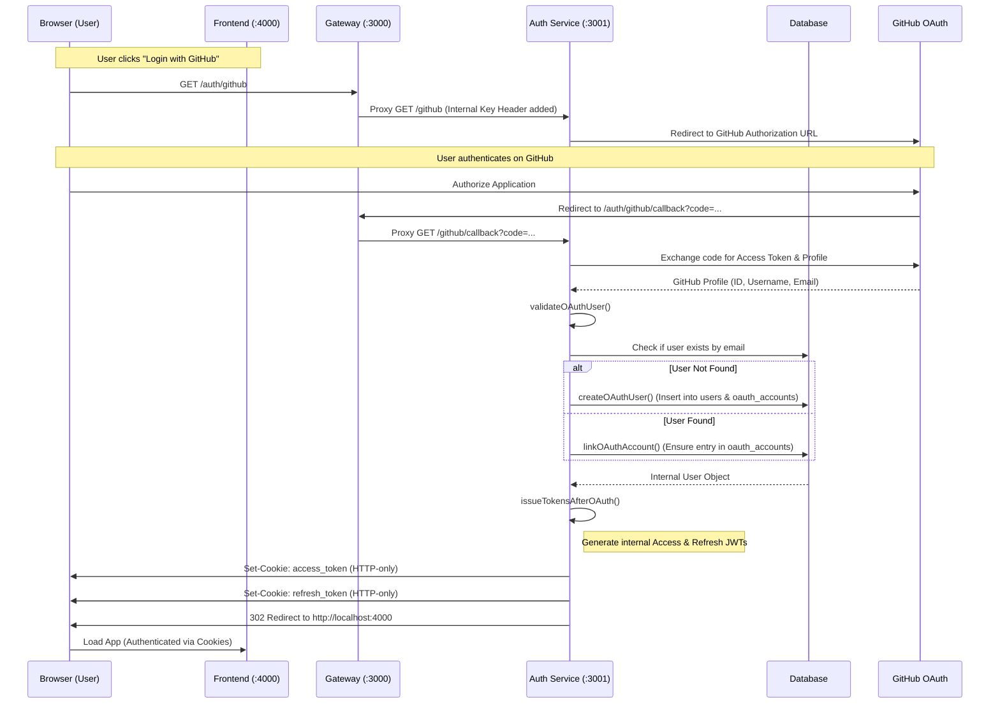
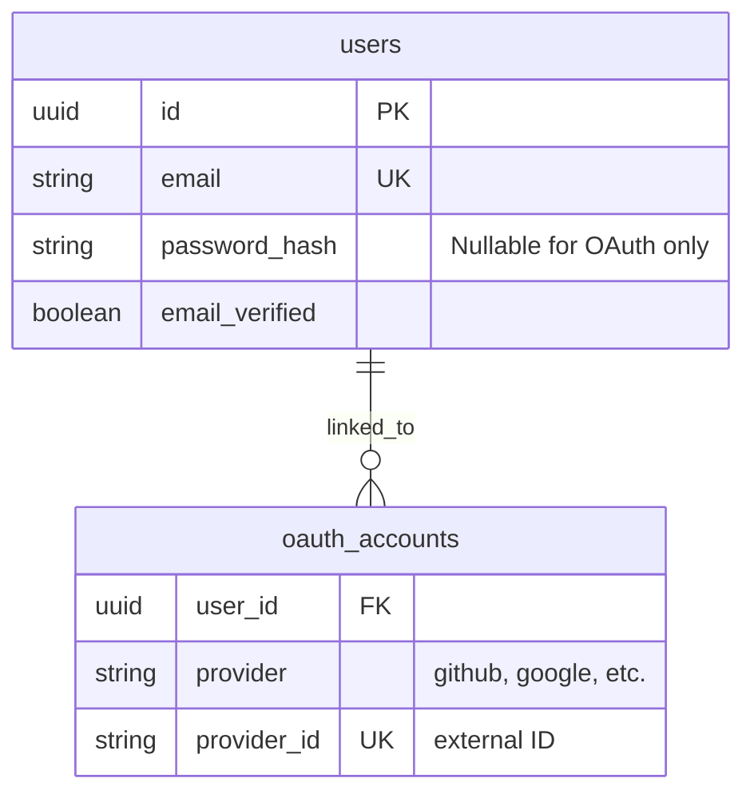

# OAuth Authentication Flow

This document describes the exact sequence of events for GitHub OAuth authentication in the Matcha application.

## Architecture Components
- **Frontend**: `http://localhost:4000`
- **API Gateway**: `http://localhost:3000` (Proxies `/auth/*` to Auth Service)
- **Auth Microservice**: `http://localhost:3001`
- **GitHub OAuth**: External Identity Provider

## Sequence Flow

## Implementation Details

### 1. Strategy Pattern
The implementation uses a base `OAuth2Strategy` in `backend/apps/auth/src/strategies/oauth.strategy.ts` to provide a common foundation. The `GithubStrategy` extends this base, making it easy to add future providers (Google, Discord, etc.) by simply creating a new strategy file and registering it in `AppModule`.

### 2. User Handling (`validateOAuthUser`)
- If a user logs in with GitHub using an email already registered via standard registration, the accounts are automatically linked in the `oauth_accounts` table.
- **Username Conflict Handling**: If a new OAuth user's provider username (e.g., GitHub handle) is already taken in our system, a fallback username is generated (e.g., `githubuser_1234`) to ensure uniqueness in the `users` table.
- Use `email_verified: TRUE` for OAuth users by default, as the provider has already verified the email.

## Account Overlapping & Linking

In this system, a user account is uniquely identified by its **email address**. This allows "Normal" (email/password) accounts and "OAuth" accounts to overlap seamlessly.

### Scenario A: Manual then OAuth (Automatic Linking)
1.  **User registers** manually with `alice@example.com` and a password.
2.  Later, the user clicks **"Login with GitHub"** (using the same email).
3.  The system identifies the existing account via the email.
4.  The system **links** the GitHub ID to the existing `userId` in the `oauth_accounts` table.
5.  **Result**: Alice now has one account she can access via *either* password or GitHub.

### Scenario B: OAuth then Manual (Password Setup)
1.  **User registers** via GitHub with `bob@example.com`.
2.  The system creates a new user with `email_verified = TRUE` but `password_hash = NULL`.
3.  Later, Bob wants to set a password. He uses the **"Forgot Password"** flow.
4.  The system sends a reset link, Bob sets a password.
5.  **Result**: Bob now has one account with a GitHub link AND a password.

### Scenario C: Multiple OAuth Providers
1.  User has already linked GitHub.
2.  User logs in with **Google** (using the same email).
3.  The system adds a new entry in `oauth_accounts` for Google, pointing to the same `userId`.
4.  **Result**: One account, multiple social login options.

### Database Relationship

## Security considerations for overlapping
- **Email is the Source of Truth**: We trust the OAuth provider (GitHub/Google) to have verified the email. If the emails match, we assume they are the same person.
- **Verification**: If a manual account was unverified, logging in via OAuth automatically verifies it (since the provider verified it).

## Security
- **HTTP-only Cookies**: The internal JWTs are never exposed to client-side JavaScript, mitigating XSS risks.
- **Gateway Proxying**: The frontend only communicates with port 3000. All routing and internal header injection (Internal Key) happens at the Gateway level.
- **Hashed Refresh Tokens**: Refresh tokens are stored as bcrypt hashes in the database.

## Configuration Requirements
The following must be set in `backend/.env`:
- `GITHUB_CLIENT_ID`: From GitHub Developer Settings.
- `GITHUB_CLIENT_SECRET`: From GitHub Developer Settings.
- `GITHUB_CALLBACK_URL`: `http://localhost:3000/auth/github/callback`
- `FRONTEND_URL`: `http://localhost`
- `FRONTEND_PORT`: `4000`
